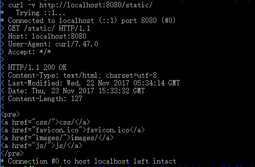
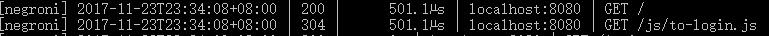
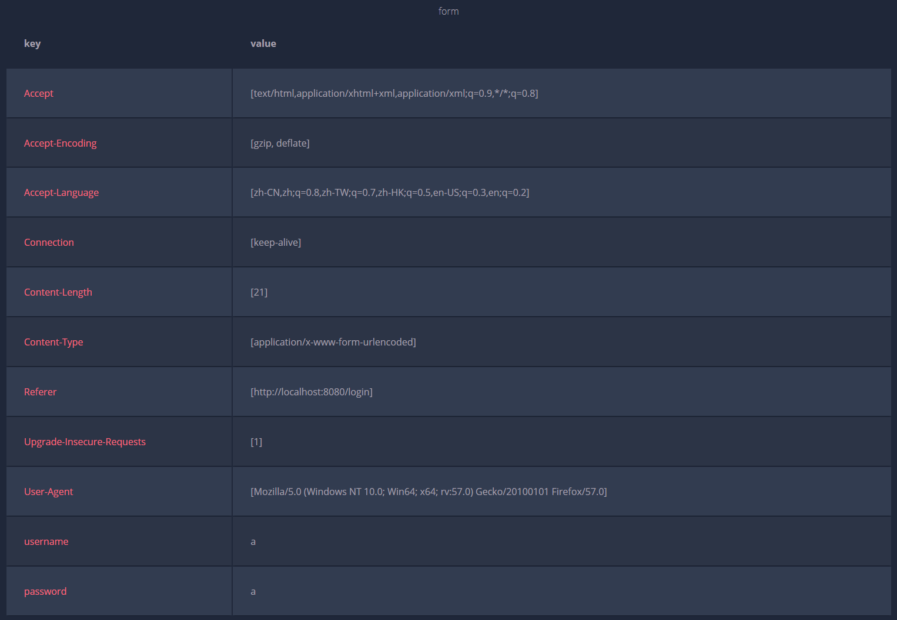
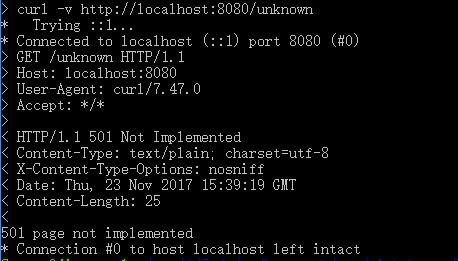

# cloudgo-io
web 小应用，展示静态文件服务、js 请求支持、模板输出、表单处理、Filter 中间件设计等方面的能力。

## 功能
### 支持静态文件服务
```
curl -v http://localhost:8080/static/
```

### 支持简单 js 访问

### 提交表单，并输出一个表格
```
curl -v -d "username=a&password=a" http://localhost:8080/login
```


### 对 ``/unknown`` 给出开发中的提示，返回码 ``5xx``
```
curl -v http://localhost:8080/unknown
```

